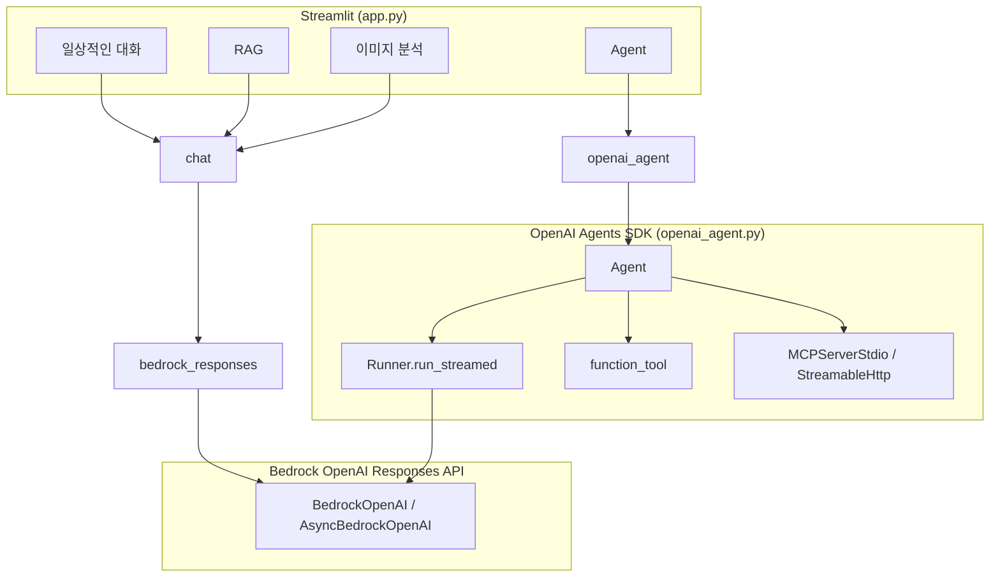

# OpenAI Agents SDK로 Agent 개발하기

AWS [Amazon Bedrock](https://developers.openai.com/api/docs/guides/amazon-bedrock)의 OpenAI 모델과 [OpenAI Agents SDK](https://developers.openai.com/api/docs/guides/agents)를 사용해 대화·RAG·도구 연동 Agent를 구현한 프로젝트입니다.

## OpenAI Agents SDK란?

[OpenAI Agents SDK](https://developers.openai.com/api/docs/guides/agents)는 **코드로 Agent를 정의하고 실행**하는 Python/TypeScript 프레임워크입니다. 단일 LLM 호출에 그치지 않고, 아래를 한 루프에서 처리합니다.

- **Agent** — 이름, 지침(instructions), 모델, 도구 목록
- **Runner** — Agent 실행·스트리밍·멀티턴(tool → LLM 반복)
- **function_tool** — Python 함수를 LLM이 호출할 수 있는 도구로 등록
- **MCP** — Model Context Protocol 서버(stdio/HTTP) 도구 연동
- **Handoff / Guardrails** — (필요 시) 전문 Agent 위임·입출력 검증

이 프로젝트에서는 Agents SDK를 **Amazon Bedrock OpenAI 엔드포인트**와 연결합니다. `AsyncBedrockOpenAI` + `set_default_openai_client()`로 SDK가 Bedrock Responses API를 사용하도록 구성합니다.

참고 문서:

- [Agents SDK Overview](https://developers.openai.com/api/docs/guides/agents)
- [Agents SDK Quickstart](https://developers.openai.com/api/docs/guides/agents/quickstart)
- [Python SDK (openai-agents-python)](https://github.com/openai/openai-agents-python)
- [OpenAI models in Amazon Bedrock](https://developers.openai.com/api/docs/guides/amazon-bedrock)

## 아키텍처



| 모드 | 모듈 | 설명 |
|------|------|------|
| 일상적인 대화 | `chat.general_conversation` | 대화 이력 + `BedrockOpenAI.responses.create` 스트리밍 |
| RAG | `chat.run_rag_with_knowledge_base` | Bedrock Knowledge Base 검색 후 Responses API 생성 |
| **Agent** | `openai_agent.run_agent` | Agents SDK + 내장 도구 + MCP + Skills |
| 이미지 분석 | `chat.summarize_image` | 멀티모달 Responses API |

상세 구조: [docs/AGENTS_MIGRATION.md](docs/AGENTS_MIGRATION.md)

## 구현 내용

### 핵심 모듈 (`application/`)

| 파일 | 역할 |
|------|------|
| `app.py` | Streamlit UI, 모드·모델·MCP·Skill 선택 |
| `openai_agent.py` | **Agents SDK Agent** — Bedrock 클라이언트, MCP, `Runner`, 스트리밍 |
| `chat.py` | 일상 대화, RAG, 이미지, 메모리, S3 |
| `bedrock_responses.py` | Responses API 공통 헬퍼(텍스트·멀티모달·청크 분할) |
| `info.py` | Bedrock OpenAI 모델 프로필(리전·model_id) |
| `mcp_config.py` | MCP 서버 정의(tavily, RAG, weather 등) |
| `skill.py` | Agent Skills (`skills/*/SKILL.md`) 메타·프롬프트 |
| `mcp_server_*.py` | FastMCP stdio 서버 |

### Agent 모드 (`openai_agent.py`)

1. **Bedrock 연결** — `AsyncBedrockOpenAI` + `aws-bedrock-token-generator`
2. **Agent 생성** — `Agent(name, instructions, model, tools, mcp_servers)`
3. **내장 도구** (`@function_tool`)
   - `execute_code` — Python 실행, `artifacts/` 산출물 추적
   - `bash` — 셸 명령
   - `upload_file_to_s3` — S3 업로드
   - `get_skill_instructions` — Skill 지침 로드
   - `builtin_current_time` / `builtin_file_read` / `builtin_file_write` — UI에서 선택
4. **MCP** — `MCPServerManager`로 stdio/HTTP 서버 `connect()` 후 도구 노출
5. **실행** — `Runner.run_streamed()` → `NotificationQueue`로 UI 스트리밍

```python
# 개념적 흐름 (실제 코드는 openai_agent.py)
agent = Agent(
    name="서연",
    instructions=system_prompt,
    model="openai.gpt-5.5",
    tools=[execute_code, bash, upload_file_to_s3, ...],
    mcp_servers=[...],
)
result = Runner.run_streamed(agent, user_query, max_turns=20)
```

### Agent Skills

`application/skills/` 아래 `SKILL.md`(YAML frontmatter)를 스캔합니다. Skill Mode가 켜지면 시스템 프롬프트에 skill 메타가 포함되고, Agent가 `get_skill_instructions`로 상세 지침을 로드한 뒤 `execute_code` 등으로 작업합니다.

### 지원 모델

| UI 이름 | model_id | Bedrock 리전 |
|---------|----------|--------------|
| OpenAI GPT 5.5 (기본) | `openai.gpt-5.5` | `us-east-2` |
| OpenAI OSS 120B | `openai.gpt-oss-120b-1:0` | `us-west-2` |
| OpenAI OSS 20B | `openai.gpt-oss-20b-1:0` | `us-west-2` |

> `openai.gpt-5.5`는 [Bedrock 가이드](https://developers.openai.com/api/docs/guides/amazon-bedrock) 기준 **us-east-2**에서 사용합니다.

### 사용하지 않는 스택

LangChain, LangGraph, AWS Strands, Claude/Nova Bedrock 모델은 **앱 LLM 경로에서 제거**했습니다. OpenAI-on-Bedrock Responses API만 사용합니다.

## 설치 및 실행

### 의존성

```bash
pip install -r requirements.txt
```

`requirements.txt` 주요 패키지:

- `openai>=2.41.0` — `BedrockOpenAI`, Responses API
- `openai-agents>=0.17.0` — Agents SDK
- `aws-bedrock-token-generator` — AWS 자격 증명 기반 Bedrock 토큰

Streamlit 등 앱 실행에 필요한 패키지는 별도 환경에 설치되어 있어야 합니다.

### 인증

**방법 A — Bedrock API Key**

```bash
export AWS_BEARER_TOKEN_BEDROCK="YOUR_BEDROCK_API_KEY"
```

**방법 B — AWS 자격 증명 (권장, Agents SDK 포함)**

`~/.aws/credentials` 또는 `aws login` 등 표준 AWS credential chain + `aws-bedrock-token-generator`가 토큰을 발급합니다.

### 설정

`application/config.json`에 S3, Knowledge Base, `sharing_url` 등을 설정합니다.

### Streamlit 앱 실행

```bash
cd application
streamlit run app.py
```

사이드바에서 **모드**, **모델**, **Agent Tool**, **MCP**, **Skill**을 선택한 뒤 채팅합니다.

## 콘솔 예제 (`console/`)

| 파일 | 내용 |
|------|------|
| `hello.py` | Bedrock Responses API 단일 응답 |
| `basic.py` | `provide_token` + 스트리밍 |
| `stream.py` | API Key 기반 스트리밍 |
| `agent_basic.py` | Agents SDK 최소 Agent (`Runner` + `function_tool`) |

```bash
cd console
python agent_basic.py
```

## Hello World (Responses API)

```python
from openai import BedrockOpenAI

client = BedrockOpenAI(aws_region="us-east-2")

response = client.responses.create(
    model="openai.gpt-5.5",
    input="AWS에서 OpenAI API를 사용하는 방법을 설명해주세요.",
)

print(response.output_text)
```

## Streaming (Responses API)

```python
from aws_bedrock_token_generator import provide_token
from openai import BedrockOpenAI

client = BedrockOpenAI(
    aws_region="us-east-2",
    bedrock_token_provider=lambda: provide_token(region="us-east-2"),
)

stream = client.responses.create(
    model="openai.gpt-5.5",
    input="AWS에서 OpenAI API를 사용하는 방법을 설명해주세요.",
    stream=True,
)

for event in stream:
    if event.type == "response.output_text.delta":
        print(event.delta, end="", flush=True)

print()
```

## Agents SDK 최소 예제

```python
import asyncio
from aws_bedrock_token_generator import provide_token
from agents import Agent, Runner, function_tool, set_default_openai_client
from openai import AsyncBedrockOpenAI

@function_tool
def greet(name: str) -> str:
    return f"Hello, {name}!"

async def main():
    client = AsyncBedrockOpenAI(
        aws_region="us-east-2",
        bedrock_token_provider=lambda: provide_token(region="us-east-2"),
    )
    set_default_openai_client(client)

    agent = Agent(
        name="assistant",
        instructions="한국어로 간단히 답하세요.",
        model="openai.gpt-5.5",
        tools=[greet],
    )
    result = await Runner.run(agent, "greet 도구로 World에게 인사해줘")
    print(result.final_output)

asyncio.run(main())
```

전체 구현은 `application/openai_agent.py`와 `console/agent_basic.py`를 참고하세요.
